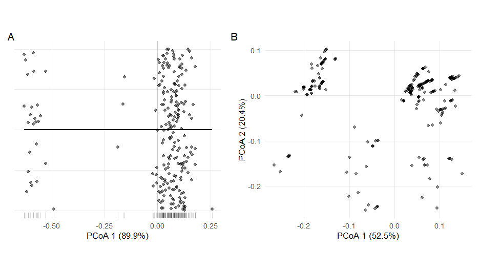
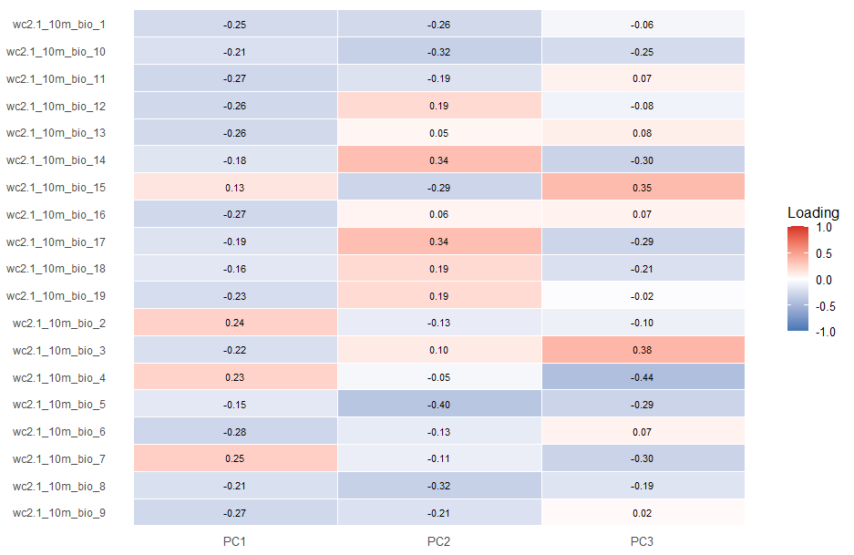
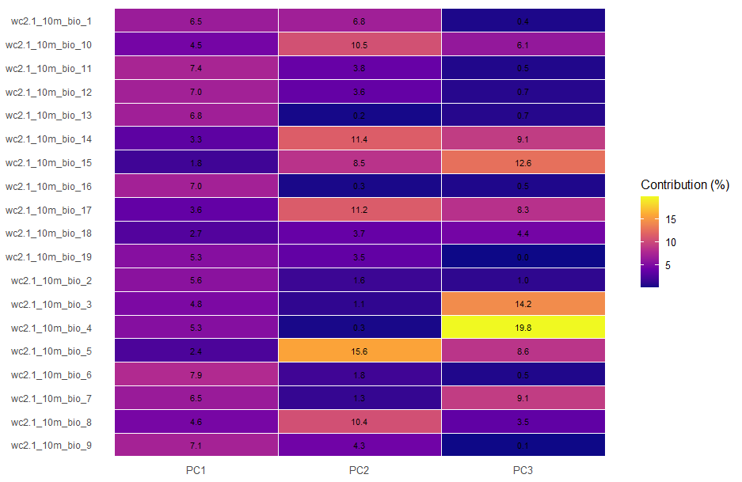
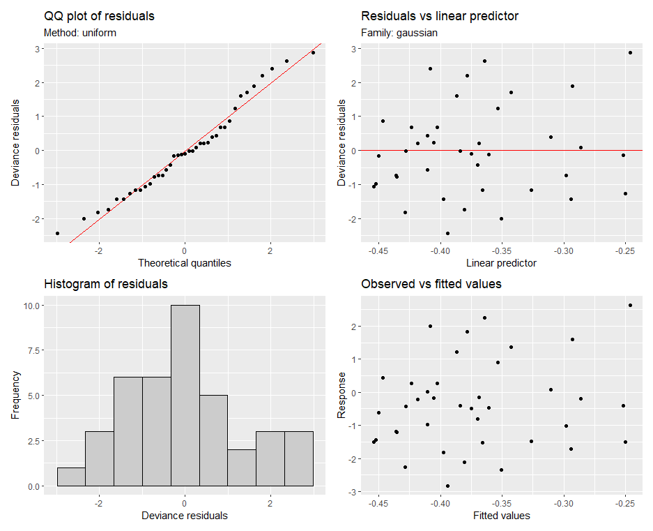
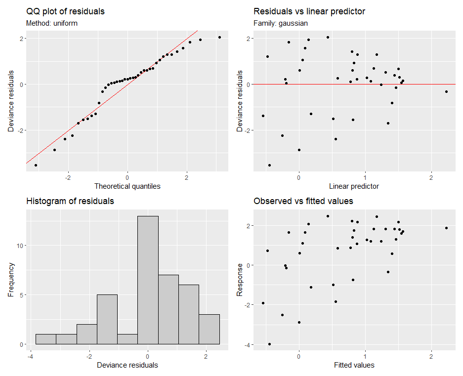

## INTRODUCTION

Ecologists often examine patterns of functional trait diversity to investigate community assembly processes (Ackerly 2003; Kraft et al. 2015). To date, however, most trait-based approaches have focused on functional trait diversity within a single trophic level, often assuming competition as the dominant species interaction structuring communities (Weiher et al., 1998; Tilman 2004). In contrast, research in network ecology has extended trait-based community assembly across trophic levels. For example, studies demonstrated that trait matching across trophic levels plays a key role in the assembly of species interactions (Lavorel et al. 2013) and the emergence of network structure. (Allesina, Alonso, and Pascual 2008; Marjakangas et al. 2022; Saravia et al. 2022). However, despite the growing availability of species trait and distribution data across multiple trophic levels (Kissling et al., 2015; Schleuning et al., 2023), our understanding of how assembly processes act within and between trophic levels jointly shape multitrophic communities remains limited (Guzman et al., 2019; Marjakangas et al., 2022)

Classical approaches to study community assembly rely on the concept of environmental filtering, where density independent conditions constrain the functional diversity of species assemblages (Laliberté and Legendre 2010; Villéger, Mason, and Mouillot 2008; HilleRisLambers et al. 2012; Kraft et al. 2015). Functional diversity is described through complementary measures such as functional richness (FR) and functional dispersion (FDis) (Mason et al., 2005; Mason, and Mouillot 2008). Functional richness is often used to estimate the strength of which environmental filtering constrains the morphological specialization of species assemblages. Functional richness typically measures the total variability of functional traits observed in a community. High functional richness can indicate weak environmental selection whereas low functional richness can indicate strong selection. Functional dispersion is often used to estimate the strength to which species partition the local trait space. Functional dispersion typically measures the degree of species clustering within a community trait space (Mason et al. 2005; Laliberté and Legendre 2010), while (Kraft et al., 2008; Kraft and Ackerly 2010; Kraft et al. 2015). High functional dispersion can indicate the coexistence of functionally distinct species, whereas low functional dispersion can indicate trait convergence (Kraft et al., 2008; Halpern and Floeter 2008; Paine et al. 2011).

In a multitrophic context, where traits mediating species interactions (e.g. plant fruit size - animal body size) across trophic levels can also mediate the responses of species to gradients in their abiotic environment (e.g. water availability – temperature) (McCain and King 2014; Moretti and Legg 2009; Dehling et al. 2020), the effects of environmental filtering can cascade to other trophic levels such that the environment filters on consumer traits can shape the functional richness or dispersion of their resources (and vice-versa). (Albrecht et al., 2018; Guzman et al. 2019). Moreover, the same environmental gradient could exert ecological pressures of different strength on communities at distinct trophic levels (Marjakangas et al. 2022). These differences may generate asymmetrical patterns of functional richness and dispersion between consumers and resources, modulated by their degree of reciprocal dependency or co-evolution (Medeiros et al., 2018; Zheng et al., 2021; Borzone et al., 2022). These asymmetries could potentially shape large scale patterns of interaction assembly and possibly constrain the structure or topologies of trophic networks (Blüthgen et al. 2007; Schleuning et al. 2012; Saravia et al., 2022; Dehling et al. 2020).

Here, we introduce the concept of functional trophic asymmetry (FTA), which allows inferring the difference of environmental filtering pressures on the functional diversity of multitrophic assemblages (Figure 1). FTA is the difference of standardized effect sizes (Z-scores) of functional richness and functional dispersion between trophic levels. FTA can occur because traits mediating species interactions (i.e., interaction niches) across trophic levels can also mediate the responses of species to their abiotic environment (i.e., environmental niches) (McCain and King 2014; Moretti and Legg 2009; Dehling et al. 2020). As an example, plant seed size determines the outcome of animal-mediated seed dispersal (Donoso et al. 2017, 2020) as well as physiological limits, such as tolerances of plant seedlings to desiccation (Hoekstra, et al., 2001). For functional richness, high FTA could indicate differences in the strength of environmental selection over the interaction niches of distinct trophic levels within a multitrophic species assemblage. Alternatively, low FTA could indicate that the strength of the environment selection shaping interaction niches is similar between trophic levels, e.g., equally weak or equally strong (Marjakangas et al. 2022). Low FTA could also emerge under strong trait matching and therefore indicate the influence of trait co-evolution during multitrophic community assembly (Dehling et al. 2014; Albrecht et al. 2018). For functional dispersion, FTA can be an indicator variation in the relative importance between trophic levels of processes promoting trait convergence or divergence, including niche differentiation and dispersal constraints (Fitzgerald et al., 2017; Bauer et al., 2021). By studying spatial variation in FTA along environmental gradients, we aim to determine the conditions when environmental filtering versus cross-trophic trait matching plays the dominant role in structuring multitrophic communities (Schleuning et al. 2020; Bello, et al 2023).

Mutualistic interactions between palms and their mammalian frugivores are important to sustain biodiversity and ecosystem function in tropical ecosystems (Jordano et al., 2010; Bogoni, Peres, and Ferraz 2020; Dracxler and Kissling 2022). Mammalian frugivores facilitate the dispersal of palm fruits, which helps to prevent local extinctions amid disturbance and to maintain biodiversity in these ecological networks (Acevedo-Quintero et al. 2020; Messeder et al. 2020; Dehling 2018). To effectively preserve the structure of these interactions, it is crucial to understand how co-occurring palm (producer) and mammalian frugivore (consumer) communities will jointly respond to global climatic change. By examining the co-variation in their functional richness and functional dispersion across broad geographic scales and linking those patterns to spatial and/or temporal variation in climate (Figure 2), we identify the key climatic factors that may influence the assembly of their mutualistic relationships. Here, we ask (1) which climatic variable(s) best explain(s) geographic variation in the functional richness and dispersion of palms and mammalian frugivores, (2) whether differences in these relationships lead to FTA, and (3) which climatic variable best explains geographic variation in FTA across the Neotropics.

![**Figure 1: Conceptual illustration of functional trophic asymmetry (FTA) along environmental gradients.** Left panels show hypothetical responses of producer (green) and consumer (orange) functional richness to an environmental gradient, with FTA represented as the vertical distance between trophic-level responses. Upper and lower panels illustrate alternative scenarios in which FTA changes or remains relatively constant across the gradient. Right panels show corresponding examples for functional dispersion (FD), where differences in the magnitude of producer and consumer functional dispersion are depicted by barplots at contrasting positions along the environmental gradient. Curves, bars, and distances are illustrative and not derived from empirical data.](images/clipboard-2550083477.png)

## METHODS

### *Study system*

We focused on multitrophic assemblages of Neotropical palms and their mutualistic, seed dispersing, mammalian frugivores. Palms (Plantae: Arecaceae) are a keystone plant family from tropical regions that provides fruit resources to a wide variety of vertebrate frugivores, including birds and mammals (Muñoz, et al., 2019; Zona and Henderson 1989). Frugivory-related traits have notably underlain palm diversification and played a key role in the evolution of palm traits (Onstein et al. 2014, 2017). Frugivorous mammals (Animalia: Mammalia) are among the most important palm-seed dispersers, particularly over long distances (Lim et al., 2020). Most frugivorous mammals feeding on palms are seed eaters and pulp eaters, dispersing palm seeds mostly via ectozoochorus dispersal (Messeder et al. 2020; Dracxler and Kissling 2022).

### *Species occurrence data*

We obtained binary species distribution data (presence/absence) of palms from the geographic range maps of (Bjorholm et al. 2005) and on mammals from the IUCN (International Union for the Conservation of Nature) data portal. We defined multitrophic assemblages across the Neotropics, by intersecting species-level range maps with Morrone’s (2014) delineation of neotropical biogeographic provinces. A species was considered present in a province when at least 5% of its occupied range cells occurred within that province, reducing the influence of marginal overlaps between species ranges and province boundaries. Species represented by fewer than ten occupied raster cells were excluded. This procedure was applied independently to palms and mammals, producing province-level presence–absence matrices for each trophic level.

*Species trait data*

We collected species-level multitrophic trait data related to the physiological tolerance of palms and frugivorous mammals to the abiotic environment and to their mutualistic interactions. For palms, we extracted data from the PalmTraits 1.0 dataset (Kissling et al. 2019). We collected data on growth form, maximum stem height, and average fruit length. For frugivorous mammals, we obtained trait data from the EltonTraits 1.0 database (Wilman et al. 2014). We selected data on body mass, diet, and daily activities. Diet data from the EltonTraits 1.0 database is coded as percentage use distribution across ten diet categories. We excluded from our analysis species without fruit in their diet. Activity was coded as a dummy variable with three categories (Diurnal, Crepuscular, Nocturnal). Finally, body mass was coded as a numerical variable in kg. We excluded bats from the analysis as almost no Neotropical bat species is feeding on palm fruits (Messeder et al. 2020). In total, we worked with a set of 494 palm species and 488 mammal frugivore species with linked trait and geographic data, which comprised respectively \~61% (Roncal et al., 2013; Baslev et al., 2015) and \~64% (Fuzessy & Pizo 2025) of reported species for the Neotropics.

### *Climatic data*

We used the 19 bioclimatic variables from WorldClim v2.1 (Fick & Hijmans, 2017) to characterize large-scale climatic variation across Neotropical biogeographic regions. For each region, we extracted the mean value of each bioclimatic variable by averaging raster cells contained within regional boundaries. To reduce dimensionality and account for collinearity among climatic predictors, we performed a principal component analysis (PCA) on the standardized bioclimatic variables. The first three principal components captured the dominant gradients of climatic variation across the Neotropics. PCA effectively summarized climatic variation across biogeographic regions into three principal components that together explained 87.9% of the total variance (Table S1). PC1 (59.7%) described a gradient from warm, wet, and climatically stable environments (negative values) to cooler and more thermally seasonal climates (positive values). PC2 (19.3%) represented variation in dry-season moisture availability, ranging from hot climates with pronounced dry seasons (negative values) to climates with wetter dry periods (positive values). PC3 (8.9%) captured a transition from temperature-driven seasonality (negative values) to precipitation-driven seasonality (positive values) (Figure 2). These linear components were subsequently used as predictors in all analyses of functional diversity and functional trophic asymmetry.

![**Figure 2. Climatic principal components and their geographic distribution across biogeographic provinces in the Neotropics.** (A) PCA loading plot showing the loadings of the 19 WorldClim bioclimatic variables on the first two principal components (PC1 and PC2). Blue arrows represent precipitation variables and orange arrows represent temperature variables. Variable abbreviations are: MAP, mean annual precipitation; PWetQ, precipitation of the wettest quarter; PDryQ, precipitation of the driest quarter; PWarmQ, precipitation of the warmest quarter; PColdQ, precipitation of the coldest quarter; PWM, precipitation of the wettest month; PDM, precipitation of the driest month; PS, precipitation seasonality; MAT, mean annual temperature; MTCM, mean temperature of the coldest month; MTWM, mean temperature of the warmest month; MTColdQ, mean temperature of the coldest quarter; MTWarmQ, mean temperature of the warmest quarter; MTDryQ, mean temperature of the driest quarter; MTWetQ, mean temperature of the wettest quarter; TAR, annual temperature range; MDR, mean diurnal range; TS, temperature seasonality; and ISO, isothermality. The shaded quadrants represent four broad climatic domains defined by the PCA axes: warm/stable + wet, cold/seasonal + wet, warm/stable + dry, and cold/seasonal + dry. Therefore, PC1 represents a gradient from warm, climatically stable environments to colder, more seasonal climates, whereas PC2 represents a gradient from wetter to drier conditions. (B) Geographic distribution of these four climatic domains across biogeographic provinces (Morrone 2014) in the Neotropics](images/clipboard-1627886034.png)

**Statistical analysis**

Functional diversity (FD) metrics were quantified from multidimensional trait spaces constructed independently for palms and mammals. Species-level functional dissimilarities were calculated using Gower distances to accommodate mixed trait types, and principal coordinates analysis (PCoA) was used to project species into continuous functional trait spaces. For each trophic level, we retained the minimum number of PCoA axes required to explain at least 75% of the total trait variation. Local FD metrics were calculated from the subset of species present within a biogeographical province. For each assemblage, we quantified species richness, functional richness (FR) and functional dispersion (FDis). Functional richness (FR) measured the occupied volume of the local assemblage within the larger trait space of the continental pool. Functional dispersion (FDis) measured the clustering of species within trait space relative to the assemblage centroid, reflecting the degree of trait divergence or trait clustering within a species assemblage. Metrics were calculated separately for palms and mammals using the FD package in R (Laliberte & Legendre 2010). Biogeographic assemblages containing fewer than three species of palms and mammals respectively were excluded from estimations.

We standardized each observed functional richness and functional dispersion metric against a richness-constrained expected metric values drawn from a distribution of null assemblages. For each palm and mammal assemblage, we generated 999 null assemblages by randomly selecting the same number of observed species from the continental species pool without replacement and recalculating FR and FDis at each permutation. Standardized effect sizes were calculated as the difference between the observed value and the mean null expectation, divided by the standard deviation of the null distribution. Positive SES values indicate increased trait volumes or trait overdispersion, whereas negative values indicate reduced trait-space volumes and trait clustering.

We quantified FTA as the difference between mammal and palm SES values. Positive values indicate that mammal assemblages exhibit greater functional richness or dispersion relative to null expectations than palm assemblages, whereas negative values indicate the opposite. To assess climatic influences on functional trophic asymmetry, we fitted separate Generalized Additive Models (GAMs) for FTA-FR and FTA-FDis using the three climatic principal components described above as predictors. GAMs are allowed for non-linear responses through penalized smooth functions (Wood 2017), with separate smooths fitted for each climatic predictor.

## RESULTS

**Spatial distribution of trophic functional diversity and asymmetry**

Functional diversity exhibited marked geographic variation across the Neotropics. Palm functional richness was generally highest in Central America and parts of eastern and southern South America (Figure 3A), whereas mammal functional richness was highest in eastern Brazil but comparatively low across much of Amazonia and western South America (Figure 3B). Consequently, functional trophic asymmetry in richness exhibited a pronounced west–east gradient (Figure 3C), with palm assemblages exceeding mammal assemblages across much of Amazonia and mammal assemblages exhibiting relatively greater functional richness in eastern South America. Patterns of functional dispersion differed from those of richness. Palm functional dispersion peaked in southeastern Brazil (Figure 3D), whereas mammal functional dispersion was elevated throughout much of tropical South America (Figure 3E). Functional trophic asymmetry in dispersion displayed a distinct spatial pattern characterized by broadly positive values across much of the Neotropics but negative values concentrated in southeastern Brazil (Figure 3F).

![Figure 3: Spatial patterns of functional richness, functional dispersion, and functional trophic asymmetry across Neotropical biogeographic provinces. Maps show standardized effect sizes (SES) of functional richness (top row) and functional dispersion (bottom row) for palm assemblages (left column), mammal assemblages (middle column), and functional trophic asymmetry (FTA; right column). Positive SES values (red) indicate greater functional structure than expected under null model expectations, whereas negative SES values (blue) indicate lower functional structure than expected. FTA represents the difference in SES between producer and consumer assemblages for each biogeographic province. Biogeographic provinces are delineated according to the Neotropical regionalization of Morrone (2014).](images/clipboard-2754028270.png)

**The influence of climate on the functional diversity of palms and mammals**

Precipitation seasonality and dry-season severity shaped mammal functional richness but had little influence on palm functional richness (Figure 4 A-B, Table 1). Mammal SES functional richness was significantly associated with PC2, the moisture availability and dry-season intensity gradient (F = 1.23, *P* = 0.022), while PC1 showed a weak, non-significant trend (*P* = 0.101) (Table 1). The mammal model explained 19.8% of the deviance (adjusted R² = 0.140) (Table 2). In contrast, Palm SES functional richness showed no significant relationship with any climatic axis, with the model explaining only 4.1% of the deviance (adjusted R² = 0.025) (Tables 1, 2). Temperature seasonality, moisture availability, and climatic stability shaped mammal functional dispersion but had comparatively little influence on palm functional dispersion (Figure 4C-D, Table 1). Mammal SES functional dispersion was significantly associated with both PC1, the broad temperature–seasonality gradient (F = 1.99, *P* = 0.007), while PC2 showed a marginal effect (*P* = 0.071) (Table 1). The mammal model explained 32.2% of the deviance (adjusted R² = 0.265) (Table 2). In contrast, Palm SES functional dispersion showed only a weak, non-significant association with PC1, the temperature–seasonality gradient (F = 0.72, *P* = 0.091), while PC2 had no significant effects (Table 1). The palm model explained 14.4% of the deviance (adjusted R² = 0.098) (Table 2).  Climatic gradients remained robust predictors of multitrophic functional diversity after controlling for biogeographical spatial structure (Figure 6). Specifically, model support remained virtually unchanged for palm functional richness, mammal functional dispersion (ΔAIC \< 1). However, models of palm functional dispersion showed a modest improvement after accounting for space (ΔAIC = 3.85), whereas mammal functional richness exhibited a substantial increase in model support (ΔAIC = 22.6; deviance explained = 70.3%) (Table 2).

![**Figure 4. Climatic responses of producer and consumer functional diversity across the two major climatic gradients.** Partial effects from generalized additive models relating climatic principal components to functional richness (FRic; left column) and functional dispersion (FDis; right column) of palm (green) and mammal (orange) assemblages. (A) FRic responses to PC1. (B) FDis responses to PC1. (C) FRic responses to PC2. (D) FDis responses to PC2. Solid lines represent fitted smooth functions and shaded ribbons denote ±2 standard errors. Principal components summarize multivariate climatic variation derived from 19 bioclimatic variables (Figure 2). Responses are shown on the scale of the model partial effects, with positive and negative values indicating increases and decreases in functional diversity relative to the model intercept, respectively.](images/clipboard-420124593.png)

**The influence of climate on functional trophic asymmetry**

The climatic mechanisms differed between the two dimensions of functional diversity. While functional richness asymmetry exhibited little climatic structure, with SES FR asymmetry showing no significant relationship with any climatic axis and climate explaining only 1.4% of the deviance, functional dispersion asymmetry emerged primarily along the PC1 climatic gradient, which was the only significant predictor of SES FDis asymmetry (F = 2.86, P = 0.002), explaining 29.4% of the deviance (adjusted R² = 0.243), whereas PC2 had no detectable effects (Figure 5, Table 1). Model support remained virtually unchanged for both FTA metrics (ΔAIC \< 1) (Figure 6)

::: {.callout-note collapse="true"}
#### Table 1: Significance of climatic gradients in generalized additive models of functional diversity and trophic asymmetry.

Estimated degrees of freedom (EDF), F-statistics, and associated P-values for smooth terms relating the first three climatic principal components (PC1–PC3) to functional richness (FRic), functional dispersion (FDis), and functional trophic asymmetry (FTA). Climatic effects were generally weak for richness-based metrics, with only mammal FRic showing a significant association with PC2. In contrast, dispersion-based metrics exhibited stronger climatic relationships, particularly for mammal FDis, which was significantly associated with PC1 and PC3, and FTA FDis, which showed a significant association with PC1. Estimated degrees of freedom close to zero indicate little support for nonlinear responses along the corresponding climatic gradient.

| Response    | **PC1** |      |           | **PC2** |      |           | **PC3** |      |           |
|--------|--------|--------|--------|--------|--------|--------|--------|--------|--------|
|             | edf     | F    | *P*       | edf     | F    | *P*       | edf     | F    | *P*       |
| Palm FRic   | 0.60    | 0.25 | 0.201     | 0.00    | 0.00 | 0.441     | 0.00    | 0.00 | 0.623     |
| Palm FDis   | 1.19    | 0.72 | 0.091     | 0.00    | 0.00 | 0.363     | 0.73    | 0.34 | 0.159     |
| Mammal FRic | 1.43    | 0.83 | 0.101     | 1.17    | 1.23 | **0.022** | 0.00    | 0.00 | 0.634     |
| Mammal FDis | 1.45    | 1.99 | **0.007** | 0.69    | 0.55 | 0.071     | 0.81    | 1.06 | **0.028** |
| FTA FRic    | 0.00    | 0.00 | 0.399     | 0.24    | 0.08 | 0.260     | 0.00    | 0.00 | 0.979     |
| FTA FDis    | 1.65    | 2.86 | **0.002** | 0.92    | 0.40 | 0.166     | 0.00    | 0.00 | 0.927     |
:::

::: {.callout-note collapse="true"}
#### Table 2: Performance of generalized additive models relating climatic gradients to functional diversity and trophic asymmetry across Neotropical biogeographic provinces.

Model performance is summarized by the percentage of deviance explained, adjusted R², Akaike Information Criterion (AIC), and the change in AIC following the inclusion of spatial structure (ΔAIC). Positive ΔAIC values indicate support for including spatial predictors, whereas negative values indicate no improvement over climate-only models.

| Response    | Deviance explained (%) | Adjusted *R*² | AIC        | ΔAIC     |
|-------------|------------------------|---------------|------------|----------|
| Palm FR     | 4.1                    | 0.025         | 118.07     | -0.38    |
| Palm FDis   | 14.4                   | 0.098         | 131.60     | 0.44     |
| Mammal FR   | 19.8                   | 0.140         | 120.03     | 1.75     |
| Mammal FDis | **32.2**               | **0.265**     | **115.30** | **7.68** |
| FTA-FR      | 1.4                    | 0.008         | 136.89     | -0.27    |
| FTA-FDis    | **29.4**               | **0.243**     | 143.56     | **6.69** |
:::

![**Figure 4. Climatic distribution of functional trophic asymmetry across the two major climatic gradients.** Predicted response surfaces from generalized additive models relating climatic principal components PC1 (warm/stable to cold/seasonal) and PC2 (dry to wet) to functional trophic asymmetry in (A) functional richness (FTA-FRic) and (B) functional dispersion (FTA-FDis). Colored points represent observed biogeographic provinces, with colors indicating the magnitude and direction of asymmetry (blue = greater palm functional diversity relative to mammals; red = greater mammal functional diversity relative to palms). Contours and shaded surfaces depict model predictions across the climatic space occupied by the Neotropics. Principal components summarize multivariate climatic variation derived from 19 bioclimatic variables (Figure 2).](images/clipboard-112102465.png)

## DISCUSSION

Our study reveals that functional traits relevant to the assembly of mutualistic interactions between producers (palms) and their consumers (mammalian frugivores) are subject to different relative strengths of environmental filtering among trophic levels, and over geographic space in the Neotropics. In palm-mammal frugivore assemblages, climatic gradients exert stronger effects on mammalian than palm functional diversity. These differences (a.k.a. functional trophic asymmetry) reach their maximum in biogeographic regions characterized by strong dry-season intensity and pronounced climatic seasonality.

**The influence of climate on FTA**

Our findings suggest that contemporary climate differentially filters producer and consumer functional diversity, contributing to generating geographic variation in FTA across biogeographic regions. Rather than influencing both trophic levels in parallel, climatic gradients disproportionately reshaped mammalian functional diversity while leaving palm functional diversity comparatively unchanged, indicating that spatial variation in FTA arises primarily through climate-driven reorganization of consumer assemblages. Climatic effects were also stronger for functional dispersion than for functional richness. The stronger climatic signal for mammalian functional dispersion is consistent with previous observations of ecological packing in species-rich tropical assemblages, where warm, productive and climatically stable environments promote the coexistence of functionally similar species (Safi et al. 2011; González-Maya et al. 2017). Increased packing of consumer functional space is expected to increase overlap in potential interaction niches, allowing multiple mammal species to exploit similar sets of palm resources. Consequently, contemporary climate may reshape the organization of mutualistic interactions primarily by reorganizing consumer functional space rather than by changing the breadth of ecological strategies available for palm seed dispersal. Such changes may alter the extent to which multiple frugivore species perform similar seed-dispersal functions, thereby modifying functional redundancy within mutualistic networks. The stronger climatic response of mammalian functional diversity may reflect the greater sensitivity of mammalian functional traits to energetic constraints and resource availability (Boratynsky et al., 2021; Brand et al., 2023), whereas palm functional traits are likely buffered by longer generation times and stronger historical legacies. Such comparatively weaker climatic responses of palm functional diversity are consistent with evidence that present-day palm assemblages retain a strong historical imprint of past climatic conditions, reducing their sensitivity to contemporary environmental gradients (Kissling et al. 2012; Göldel et al. 2015).

**The potential consequences of FTA for ecological network assembly**

Differential climatic responses across trophic levels may have important consequences for the assembly and persistence of ecological interactions. Because mutualistic interactions emerge through trait matching between producers and consumers, the ecological consequences of functional trophic asymmetry are likely to depend on how strongly interactions are constrained by compatible trait combinations (Dehling et al. 2014; Bartomeus et al., 2016; Albrecht et al. 2018; Armbruster et al., 2023).  As such, the effects of functional trophic asymmetry may depend on the flexibility of species to form novel interactions (Levins 1963; Marjakangas et al., 2025).  When interactions are relatively flexible, shifts in consumer functional composition may be accommodated through partner switching, allowing interaction networks to reorganize while maintaining overall connectivity (Spiesman et al., 2016; Caradonna et al., 2020; Marjakangas et al., 2025). Conversely, where interactions rely on a narrow range of compatible trait combinations, asymmetric changes in producer and consumer functional diversity may reduce the availability of suitable interaction partners, potentially increasing the risk of interaction loss and secondary extinctions (Bascompte & Jordano 2007; Memmot et al., 2024; Schleuning et al. 2012; 2016). These suggest that functional trophic asymmetry may help identify regions where climatic change is most likely to reorganize ecological networks (Classen et al., 2020), providing a functional link between environmental filtering, trait matching, and the assembly of multitrophic networks (Markakangas et al., 2022).

An important next step will be to evaluate whether functional trophic asymmetry predicts the organization of empirical ecological networks (Hegland et al., 2020; Classen et al., 2020; Yahaya et al., 2024). Although our framework infers potential interaction niche structure from species traits and distributions, increasing availability of standardized regional interaction datasets (i.e. metawebs) (Poelen et al., 2014; Gravel et al., 2019; Maiorano et al., 2020) now provides opportunities to test whether regions with greater functional trophic asymmetry also exhibit predictable changes in network architecture, such as interaction specialization, modularity, connectance, or robustness to species loss (Bascompte et al., 2007;) . Such comparisons would establish whether asymmetries in producer and consumer functional diversity translate into realized differences in network structure and ecosystem function (Schleuning et al., 2015; Eisenhauer et al., 2019). Future studies could also bridge macroecological predictions with local ecological networks by downscaling synthetic interaction networks using information on species abundances, habitat suitability, movement, or local environmental conditions (Banville et al., 2025; Beumer et al. 2025). Incorporating these ecological constraints would improve the realism of predicted interactions while allowing explicit tests of how functional trophic asymmetry influences network assembly across spatial scales (Galiana et al., 2018; Ponisio et al., 2019; Thuiller et al., 2024).

**Functional trophic asymmetry as a multitrophic indicator of ecological processes and their response to global changes**

Our findings suggest that climatic filtering is one mechanism generating functional trophic asymmetry, but climate is unlikely to be the only driver. Habitat loss, defaunation, biological invasions, and other forms of anthropogenic environmental change can independently alter the functional composition of producers or consumers, potentially increasing or reducing asymmetry between trophic levels (Tinoco et al. 2018; Guevara et al. 2023a, 2023b; Bello et al. 2023; Guerra et al. 2025). This perspective is consistent with a growing body of evidence showing that anthropogenic disturbances often affect trophic levels asymmetrically, with consumer communities, particularly large vertebrates, frequently exhibiting greater functional losses than producers (Duffy 2003; Hogsden et al. 2009; Dirzo et al. 2014). Functional trophic asymmetry therefore provides a framework for quantifying these differential responses and comparing how diverse environmental drivers reshape the relative functional organization of interacting trophic levels. By extending trait-based approaches beyond single trophic levels, FTA offers a common basis for investigating how environmental change propagates through multitrophic communities and may ultimately influence the organization of ecological interactions.

Although we focused on climatic gradients, the contrasting responses of functional richness and functional dispersion suggest that different eco-evolutionary processes may leave distinct signatures on functional trophic asymmetry. Functional richness asymmetry likely reflects, at least in part, long-term evolutionary and biogeographic processes that determine the regional pool of functional strategies available to each trophic level. Similar contrasts between historical legacies and contemporary environmental filtering have been reported across a range of taxa, although the relative contribution of each process varies among systems. For example, Quaternary climatic history has a strong influence on plant functional diversity (Ordoñez & Svenning 2017), whereas contemporary climatic gradients more strongly structure functional diversity in woody plants and mammals (Swenson et al. 2012; Hedberg & Smith 2025). Conversely, global freshwater fish assemblages exhibit stronger historical controls on functional dispersion but stronger contemporary controls on functional richness (Su et al. 2022). Together, these findings suggest that functional trophic asymmetry extends beyond a descriptive measure of multitrophic organization by providing a framework that could be extended to investigate the relative influence of historical eco-evolutionary processes and contemporary environmental filtering on interacting trophic levels.

## CONCLUSION

As climate change accelerates, shifts in precipitation regimes, dry-season intensity, and climatic stability are likely to alter functional trophic asymmetry in multitrophic palm–frugivore assemblages in the Neotropics. Because climate and other global change drivers can differentially affect producer and consumer functional diversity, they may reshape interaction niches and the functional organization of ecological networks, potentially reducing network resilience where opportunities for interaction rewiring are limited (Tylianakis et al. 2008; Caradonna et al. 2021; Cruz et al. 2023). However, these predictions remain to be tested across different ecological systems to determine the generality of functional trophic asymmetry as an indicator of multitrophic responses to environmental change (Acosta-Rojas et al. 2023; Nowak et al. 2022; Landim et al. 2025; Rabeau et al. 2025). As species distributions continue to shift under climate change (Aizen et al. 2012; Valiente-Banuet et al. 2015; Bartley et al. 2019; Hurtado et al. 2024), functional trophic asymmetry provides a framework for generating and testing hypotheses about how differential functional responses across trophic levels may reshape ecological networks under global change.\

## Supplementary material

### Cumulative variance explained by PCoA axes

### Trait spaces of palms and mammals

## Pariwise correlations among climatic variables

PCA loadings

PCA contributions

{width="731"}

## Null model distributions

![Distribution of trophic-level standardized effect sizes and functional trophic asymmetry across Neotropical biogeographic provinces. Boxplots show standardized effect sizes of functional richness and functional dispersion for palm and mammal assemblages, together with functional trophic asymmetry (FTA), calculated as mammal SES minus palm SES. Positive FTA values indicate greater mammal functional diversity relative to null expectations than palms, whereas negative values indicate greater palm functional diversity relative to mammals.](images/clipboard-1202330071.png)

## diagnosis of GAMs

FTA-frich

FTA-fdis

![Figure 5: Improvement in model fit after accounting for spatial structure. Bars show the change in Akaike Information Criterion (ΔAIC) between climate-only models and models including both climatic and spatial predictors for functional richness (FRic), functional dispersion (FDis), and functional trophic asymmetry (FTA). Positive values indicate improved model support following the inclusion of spatial structure, whereas negative values indicate no improvement. The vertical dashed line marks ΔAIC = 2, a commonly used threshold for meaningful model improvement.](images/clipboard-2162621761.png)
